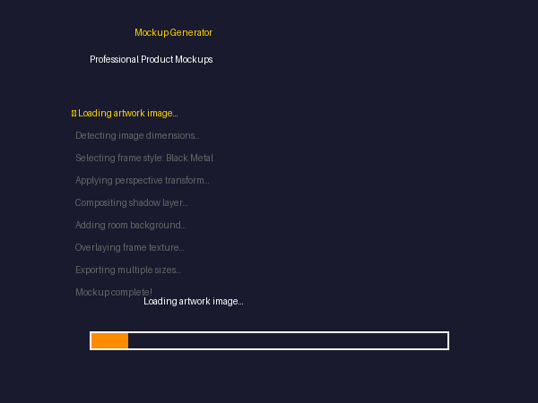
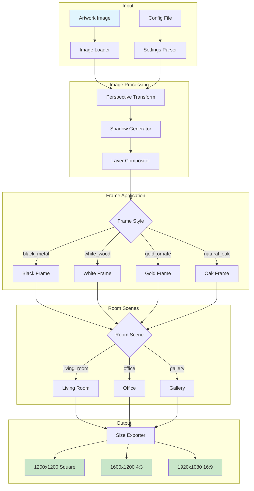

# Mockup Generator


[](https://codecov.io/gh/jjshay/mockup-generator)


**Create professional product mockups automatically - place artwork into frame templates.**



---

## What Does This Do?

Takes your artwork image and automatically:
- Places it into professional frame mockups
- Generates multiple room scene variations
- Creates gallery-quality product photos
- Outputs in multiple sizes for eBay, Etsy, Shopify

**Before:** Plain artwork photo
**After:** Professional mockup in a living room setting

---

## Quick Start

```bash
# Clone the repo
git clone https://github.com/jjshay/mockup-generator.git
cd mockup-generator

# Install dependencies
pip install -r requirements.txt

# Run the interactive demo
python demo.py

# Or run the visual showcase
python showcase.py

# Generate mockup with sample artwork
python mockup_generator.py examples/sample_artwork.jpg --output output/
```

### Sample Files
- `examples/sample_artwork.jpg` - Sample artwork image
- `examples/mockup_config.json` - Configuration options
- `sample_output/mockup_manifest.json` - Example output manifest

---

## Real Usage

### Basic Mockup Generation

```python
from mockup_generator import MockupGenerator

generator = MockupGenerator()

# Generate mockup with default frame
mockup = generator.create_mockup("my_artwork.jpg")
mockup.save("my_artwork_mockup.jpg")

# Generate with specific frame style
mockup = generator.create_mockup(
    "my_artwork.jpg",
    frame_style="black_metal",
    room_scene="living_room"
)
```

### Command Line

```bash
# Single image
python mockup_generator.py artwork.jpg -o output/

# Batch process folder
python mockup_generator.py artwork_folder/ -o mockups/ --frames all

# Specific frame styles
python mockup_generator.py artwork.jpg --frame black_metal --frame gold_ornate
```

### Available Frame Styles

| Style | Best For |
|-------|----------|
| `black_metal` | Modern, minimalist art |
| `white_wood` | Light, airy pieces |
| `gold_ornate` | Classical, traditional art |
| `natural_oak` | Rustic, nature themes |
| `floating` | Contemporary, gallery style |
| `none` | Frameless/canvas look |

### Room Scenes

- `living_room` - Cozy home setting
- `office` - Professional workspace
- `gallery` - White gallery wall
- `bedroom` - Intimate setting
- `minimal` - Plain wall background

---

## Architecture



## How It Works

1. **Load artwork image**
2. **Apply perspective transform** to match frame angle
3. **Composite onto room scene** with proper shadows
4. **Add frame overlay** with realistic lighting
5. **Export** in multiple sizes

---

## Installation

```bash
git clone https://github.com/yourusername/mockup-generator.git
cd mockup-generator
pip install -r requirements.txt
python demo.py
```

---

## API Integration (Optional)

For AI-powered background removal and smart placement:

```bash
# Add to .env file
PHOTOROOM_API_KEY=your_key_here
```

Without API keys, the system uses basic compositing which still produces good results.

---

## Output Formats

```
output/
├── artwork_black_frame_1200x1200.jpg    # Square (Instagram)
├── artwork_black_frame_1600x1200.jpg    # 4:3 (eBay)
├── artwork_black_frame_1920x1080.jpg    # 16:9 (Hero)
└── artwork_black_frame_800x800.jpg      # Thumbnail
```

---

## Files

| File | Purpose |
|------|---------|
| `demo.py` | Quick demo - run this first |
| `mockup_generator.py` | Main mockup creation |
| `TEMPLATE_BASED_MOCKUP_GENERATOR.py` | Template-based system |
| `SMART_MOCKUP_COMPOSITOR.py` | AI-powered compositing |
| `photoroom_mockup.py` | PhotoRoom API integration |

---

## License

MIT - Use freely!
